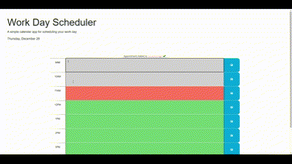

# Work Day Scheduler Starter Code

## Description
Have you ever wanted a daily scheduler for a typical 9 am to 5 pm workday?

This calendar application allows you to schedule events for each hour and save them. The application displays the current day at the top of the calendar. As you scroll down, you'll be presented with color-coded time blocks. Grey represents the past, red represents the current hour, and green represents a future hour block. Click on a time block, enter an event, and click the save icon on the right to save your event to local storage. This ensures your events persist even when you refresh the page.

## Demo

## Credits
- [Day.js - Format](https://day.js.org/docs/en/display/format)
- [MDN Web Docs - localStorage](https://developer.mozilla.org/en-US/docs/Web/API/Window/localStorage)
- [Original Work Day Scheduler Starter Code](https://github.com/coding-boot-camp/crispy-octo-meme)

## Deployment
- [GitHub Repository](https://github.com/Develepor-Dan/9-5_Work_Day_Scheduler)
- [Work Day Scheduler](https://develepor-dan.github.io/9-5_Work_Day_Scheduler/)